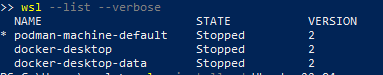
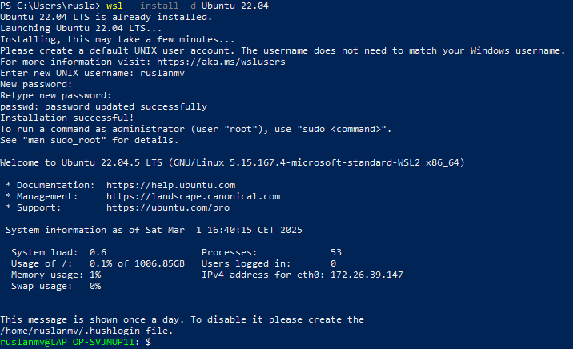
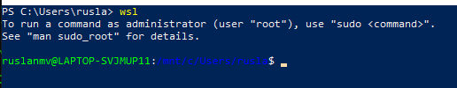
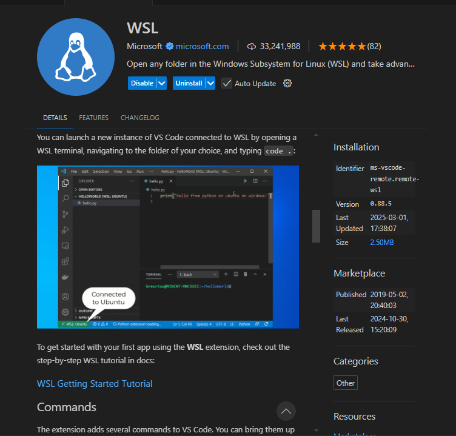
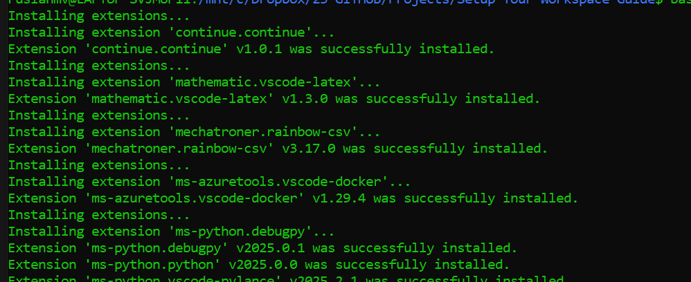
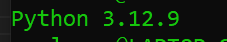

# Setup Your New Windows PC from Zero  
*Windows 10/11 | WSL & VS Code Setup v1.0*

Welcome to your one-stop guide for transforming a fresh Windows installation into a productive development workstation. In this guide, we’ll cover everything from installing the Windows Subsystem for Linux (WSL) to setting up Visual Studio Code (VS Code) for a seamless development experience. Whether you’re diving into AI, research, or just need a robust setup for coding, follow along step-by-step.

---

## Table of Contents

- [Introduction](#introduction)
- [Prerequisites](#prerequisites)
- [Step 1: Setting Up WSL](#step-1-setting-up-wsl)
  - [Check WSL Status](#check-wsl-status)
  - [Install Ubuntu 22.04](#install-ubuntu-2204)
  - [Set Default Distribution](#set-default-distribution)
  - [Launch WSL](#launch-wsl)
- [Step 2: Troubleshooting WSL](#step-2-troubleshooting-wsl)
- [Step 3: First Actions in WSL](#step-3-first-actions-in-wsl)
- [Step 4: Setting Up VS Code with WSL](#step-4-setting-up-vs-code-with-wsl)
  - [Install VS Code & Remote - WSL Extension](#install-vs-code--remote---wsl-extension)
  - [Launch VS Code from WSL](#launch-vs-code-from-wsl)
- [Step 5: Exporting & Installing Extensions (Optional)](#step-5-exporting--installing-extensions-optional)
- [Conclusion](#conclusion)

---

## Introduction

Starting from scratch can be both exciting and challenging. This guide is designed to help you quickly transform a new PC into a powerful development environment. We’ll use the Windows Subsystem for Linux (WSL) with Ubuntu 22.04 for a Linux-like experience and VS Code for a modern, robust coding interface.

---

## Prerequisites

- **Operating System:** Windows 10 or Windows 11  
- **Internet Connection:** Required for downloads and updates  
- **Administrator Access:** Needed for installing WSL and other system changes

---

## Step 1: Setting Up WSL

WSL (Windows Subsystem for Linux) lets you run a Linux environment directly on Windows without the overhead of a virtual machine. We will use **Ubuntu 22.04** as our Linux distribution.

### Check WSL Status

Open **PowerShell** as an administrator and check if WSL is already installed by running:

```bash
wsl --list --verbose
```



### Install Ubuntu 22.04

If Ubuntu 22.04 is not installed, run the following command:

```bash
wsl --install -d Ubuntu-22.04
```



### Set Default Distribution

To ensure that Ubuntu 22.04 is your default WSL distribution, execute:

```bash
wsl --set-default Ubuntu-22.04
```

After setting the default, you can verify by listing distributions again:

```bash
wsl --list --verbose
```

### Launch WSL

Once installed, simply type:

```bash
wsl
```

This will open your Ubuntu terminal within WSL.



---

## Step 2: Troubleshooting WSL

If you encounter issues or need to remove the current Ubuntu 22.04 installation, you can terminate and unregister it. **Warning:** Unregistering will delete all data for that distribution.

Terminate the running instance:

```bash
wsl --terminate Ubuntu-22.04
```

Then unregister (remove) the distribution:

```bash
wsl --unregister Ubuntu-22.04
```

---

## Step 3: First Actions in WSL

Before diving into development, it’s essential to update your package lists:

```bash
sudo apt-get update
```

This command fetches the latest package information and ensures your system is up-to-date.

---

## Step 4: Setting Up VS Code with WSL

Visual Studio Code (VS Code) provides a powerful and flexible code editor that integrates seamlessly with WSL.

### Install VS Code & Remote - WSL Extension

1. **Download & Install VS Code:**  
   Visit the [official VS Code website](https://code.visualstudio.com/) and install the latest version for Windows.

2. **Install the "Remote - WSL" Extension:**
   - Open VS Code.
   - Go to the Extensions view by pressing `Ctrl+Shift+X`.
   - Search for **Remote - WSL**.
   - Click **Install**.



### Launch VS Code from WSL

With the Remote - WSL extension installed, you can now launch VS Code from within your Ubuntu terminal:

1. Open your Ubuntu terminal (WSL).
2. Navigate to your project directory or where you want to work.
3. Run the following command:

    ```bash
    code .
    ```

This command opens the current directory in VS Code. You’ll notice a WSL indicator in the bottom left corner, confirming that VS Code is connected to your Linux environment.

---

## Step 5: Exporting & Installing Extensions (Optional)

To keep your VS Code extensions synchronized between machines:

1. **Export Extensions from Your Old Setup:**

    ```bash
    code --list-extensions > extensions.txt
    ```

2. **Install Extensions on Your New Machine:**

   Create a script (e.g., `install_extensions.sh`) with the following content:

    ```bash
    #!/bin/bash
    while read extension; do
      code --install-extension "$extension"
    done < extensions.txt
    ```

   Make the script executable and run it:

    ```bash
    chmod +x install_extensions.sh
    bash install_extensions.sh
    ```




## Installing Essetials

sudo add-apt-repository ppa:deadsnakes/ppa

```
sudo apt update
```

```
sudo apt upgrade

```

Install Python 3.12 and Pip:

```
sudo apt install python3.12 python3.12-dev python3-pip python3.12-venv -y

```

Set Python 3.12 as the Default Version:


```
sudo update-alternatives --install /usr/bin/python python /usr/bin/python3.12 1
```
Verify the Python version:
```
python --version
```



### Step to create a virtual environment:

1. Create a new virtual environment (let’s call it `.venv`):
   ```bash
   python -m venv .venv
   ```

2. Activate the virtual environment:
   - On Linux/macOS:
     ```bash
     source .venv/bin/activate
     ```
   - On Windows:
     ```bash
     .venv\Scripts\activate
     ```
For development we suggest also install (optional):
```
pip install ipykernel
```

 
### Node


### Check the Current Node.js Version
Open the terminal and run:
```bash
node -v
```
This will display the currently installed version.

---

###  Remove the Existing Node.js Version
If you installed Node.js using `apt`, remove it first:
```bash
sudo apt remove -y nodejs
sudo apt purge -y nodejs
sudo apt autoremove -y
```

---

###  Install Node.js 20

####  Using NodeSource
1. **Add Node.js 20 Repository**
   ```bash
   curl -fsSL https://deb.nodesource.com/setup_20.x | sudo -E bash -
   ```
2. **Install Node.js**
   ```bash
   sudo apt install -y nodejs
   ```
3. **Verify the Installation**
   ```bash
   node -v
   ```
   It should now show `v20.x.x`.

---


---

## Conclusion

Congratulations! You’ve now set up a full development environment on your new Windows PC using WSL and VS Code. This guide has provided a clear path from installing Ubuntu 22.04 under WSL to getting your favorite code editor up and running. Whether you’re developing AI applications, researching, or simply coding for fun, this setup lays a robust foundation for productivity.

---

*Happy Setup & Happy Coding!*
